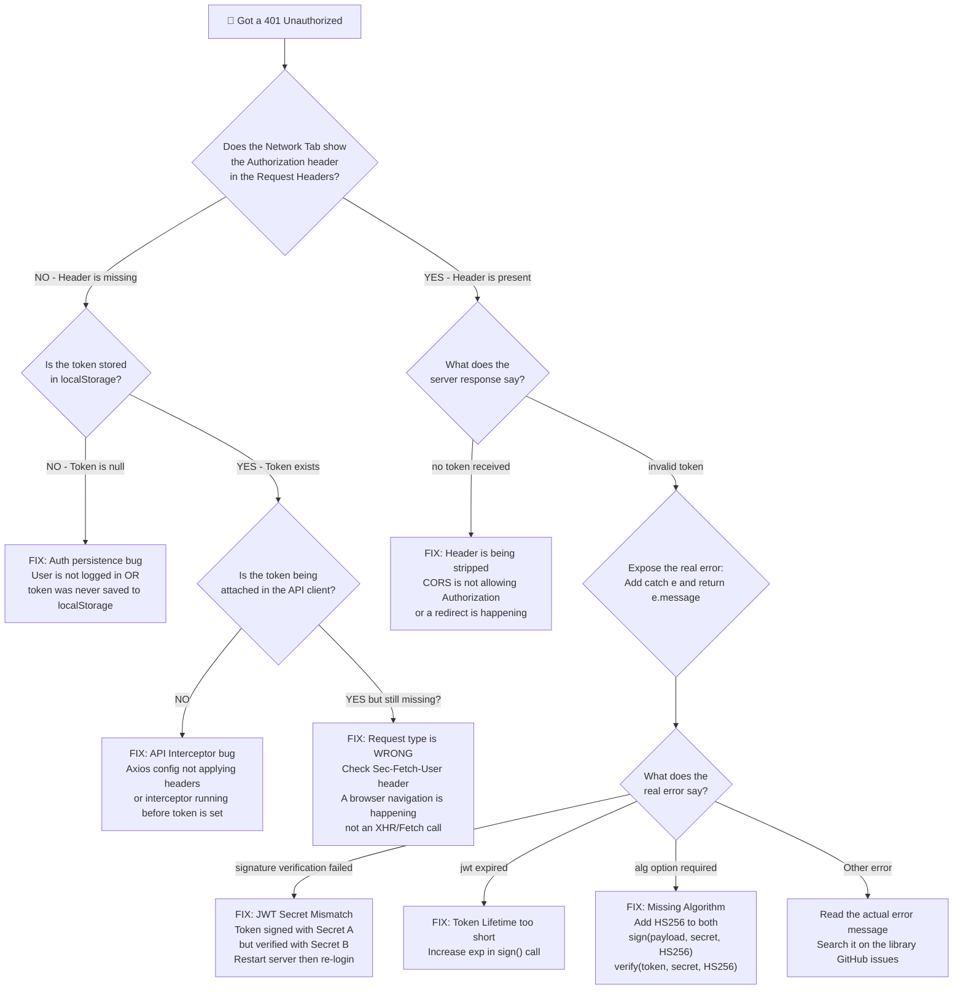

# 🐛 The Art of Debugging: A Personal Field Guide
### Based on the real LetterAlchemy 401 Auth crisis — written for you, at 3am

---

## The Core Philosophy (Before Any Code)

> **"Debugging is not fixing. Debugging is understanding."**

Before you touch a single line of code, ask yourself one question:
**"What do I know for certain, and what am I only assuming?"**

Most bugs survive because developers fix assumptions instead of facts.

---

## The Layered Debugging System

Think of your stack like an onion. A request travels through many layers. Your job is to **find the exact layer where it breaks**, then fix only that layer.

```
Browser → Frontend Code → HTTP Request → CORS → Backend Router → Middleware → Business Logic → Database
```

When something fails, you don't randomly poke the onion. You **cut it in half and check the middle first**, then go left or right. This is called **Binary Search Debugging**.

---

## The Flowchart: How to Debug a 401 on Any API



---

## The Exact Debugging Session: Reconstructed Step-by-Step

### 🔴 Starting Point: `POST /api/v1/create` → 500 Internal Server Error

We did not know where the problem was. We started at the **outermost layer** — the network response.

---

### 🟡 Step 1: Read the HTTP Headers, Not Just the Status Code

**Tool used:** Browser DevTools → Network Tab → Click the failed request → Headers tab

**What we looked for:**
- Is the `Authorization` header in the **Request Headers**?
- What is the `Content-Type`?
- Are there any unexpected headers?

**What we found:** The `Authorization` header WAS being sent.
**But the server returned 500**, so the problem was in the **backend business logic**, not the auth.

**Lesson:** The HTTP status code tells you *which layer* failed.
- `4xx` = The request was bad (your fault)
- `5xx` = The server crashed (backend's fault)
- `401` = Auth failed (could be either)

---

### 🟡 Step 2: Add a "Checkpoint" to the Backend

When the server gives a vague error, you **add a console.log or return a JSON debug response** to know if the code is even reaching that point.

**What we did:** Inside `authmiddleware`, we added:
```typescript
// BEFORE verifying, just return everything we received
const allHeaders = Object.keys(c.req.header());
return c.json({ 
    msg: "debug checkpoint",
    received_headers: allHeaders  // <-- This is the "checkpoint"
}, 401);
```

**This technique is called "Checkpoint Debugging."** You temporarily make the server return early with a JSON snapshot of its state. This tells you:
1. Did the code reach this function?
2. What data does the function have at this moment?

**What we found:** `received_headers` showed `authorization` was **completely missing** from the server's perspective.

---

### 🟡 Step 3: Read the Request Headers Like a Detective

We got the list of headers the server saw:
```json
["accept", "sec-fetch-user", "upgrade-insecure-requests", "user-agent"]
```

**Key insight:** `sec-fetch-user` and `upgrade-insecure-requests` are **browser navigation headers**. These are ONLY sent when the user physically types a URL or clicks a link. They are **NOT sent by Axios or fetch()**.

This meant: the request hitting the server was a **browser navigation**, not our Axios API call.

**How to remember this:**

| Header Present | What it means |
|---|---|
| `sec-fetch-user` | Browser navigation (address bar or form submit) |
| `content-type: application/json` | Programmatic request (Axios or fetch) |
| `authorization: Bearer ...` | Auth header was attached correctly |

---

### 🟡 Step 4: The Token Was Never Reaching the Interceptor

We added a `console.log` to our Axios interceptor:
```typescript
apiClient.interceptors.request.use((config) => {
    const token = localStorage.getItem("token");
    console.log("Token found:", token ? "YES" : "NO"); // <-- Console checkpoint
    ...
});
```

**Tool used:** Browser → Console tab (not Network tab!)

**Lesson: There are two different places to look:**
- **Network Tab** → What actually went over the wire (the HTTP request)
- **Console Tab** → What your JavaScript code is doing internally

---

### 🟡 Step 5: Bypassing the Abstraction to Confirm the Theory

When Axios is behaving suspiciously, **bypass Axios entirely** and use raw `fetch` to test the same request. This eliminates the entire Axios layer as a variable.

```typescript
// Temporarily replace this:
const res = await apiClient.post("/create", data);

// With this:
const token = localStorage.getItem("token");
const res = await fetch("http://localhost:8787/api/v1/create", {
    method: "POST",
    headers: {
        "Content-Type": "application/json",
        "Authorization": `Bearer ${token}`,  // explicit, no magic
    },
    body: JSON.stringify(data),
});
const json = await res.json();
console.log("Raw fetch response:", json);
```

**What this proves:** If `fetch` works but Axios does not, the bug is in Axios config. If both fail, the bug is in the backend.

**What we found:** `fetch` got `{"msg": "invalid token"}` — meaning the token **was being sent**, but the backend could not verify it. Progress!

---

### 🟡 Step 6: Expose the Hidden Error (The Most Important Technique)

The backend's `catch` block was swallowing the real error:
```typescript
// BAD - hides the truth
} catch {
    return c.json({ msg: "invalid token" }, 401);
}
```

We changed it to **expose the real reason**:
```typescript
// GOOD - tells you exactly what failed
} catch (e: any) {
    console.error("[auth] JWT verify failed:", e?.message || e);
    return c.json({ 
        msg: "invalid token", 
        reason: e?.message || String(e)  // <-- The real error
    }, 401);
}
```

**This is the single most powerful technique in backend debugging.**
Any time you see a vague error like `"internal server error"` or `"invalid token"`, the first thing you do is find the `catch` block and expose `e.message`.

**What the real error said:**
```json
{
    "reason": "JWT verification requires \"alg\" option to be specified"
}
```

**Root cause found.** Newer versions of `hono/jwt` made `alg` a required parameter. The fix was two lines:

```typescript
// BEFORE (broke in newer hono/jwt)
await verify(token, secret);
sign(payload, secret);

// AFTER (explicit, works everywhere)
await verify(token, secret, "HS256");
sign(payload, secret, "HS256");
```

---

## The Debugging Toolkit: Cheatsheet

### Frontend Tools

| Situation | Tool | What to look for |
|---|---|---|
| "Is the request being made?" | Network Tab → XHR/Fetch filter | Find your endpoint |
| "Is the header being sent?" | Network Tab → Request Headers | Look for `Authorization` |
| "Is my JS code running?" | Console Tab + `console.log` | Add checkpoints in your code |
| "Is the token in storage?" | Application Tab → Local Storage | Check `token` key |
| "Is Axios the problem?" | Replace with raw `fetch` | Does it work without Axios? |

### Backend Tools (Node / Hono / Wrangler)

| Situation | Technique | Example |
|---|---|---|
| "Did the request reach my route?" | `console.log` at the top | `console.log("Route hit:", c.req.url)` |
| "What headers did I receive?" | `c.req.header()` checkpoint | `return c.json({ headers: Object.keys(c.req.header()) })` |
| "Why is catch firing?" | `catch (e: any)` and expose `e.message` | `return c.json({ reason: e.message })` |
| "Is my env variable set?" | Log the first few chars | `console.log("Secret starts:", c.env.JWT_SECRET?.slice(0,5))` |
| "Is the server running fresh?" | Restart and re-login | `Ctrl+C` then `wrangler dev` then clear localStorage |

---

## Interview-Ready Explanation

If someone asks: *"How do you debug a 401 Unauthorized error in a full-stack app?"*

> "I approach it in layers, starting from the outermost layer and moving inward.
>
> **First, I check the Network tab** to see if the Authorization header is actually present in the request. If it is missing, the bug is in my frontend — either the token is not in localStorage, or my API client is not attaching it. I add a `console.log` inside my Axios interceptor to confirm if the token is being read.
>
> **If the header IS present** but I am still getting a 401, the bug is in the backend. I look at the response body — a vague message like 'invalid token' tells me nothing. So I go into the backend's `catch` block and expose `e.message` in the response. This reveals the exact error.
>
> **The most common causes** I have debugged are: a JWT library requiring an explicit algorithm like `HS256` (which newer versions of Hono enforce), a secret mismatch between signing and verifying (happens when you change a `.env` file but do not restart the server), or an expired token.
>
> **The key principle** is: never fix what you have not confirmed is broken. Use checkpoints — `console.log` in the frontend, and JSON debug responses in the backend — to narrow down the exact line where the data breaks."

---

## Common Mistakes That Cost Hours

### Mistake 1: Fixing without confirming
You change a file and assume it worked. Always verify with a checkpoint response.

### Mistake 2: Forgetting to restart the server after changing env files
`.dev.vars`, `.env` — these are **only read when the server starts**. If you change them, `Ctrl+C` and restart. Then re-login, because the old token was signed with the old secret.

### Mistake 3: A broad `catch {}` hiding the real error
This is the silent killer. Always use `catch (e: any)` and at minimum `console.error(e)`.

### Mistake 4: Testing an API by typing the URL in the browser
Typing `http://localhost:8787/api/v1/create` in the address bar sends a GET navigation request, not a POST. It will never have your Authorization header. Use the frontend app or Postman/Insomnia/Thunder Client.

### Mistake 5: Trusting the library defaults
Libraries evolve. What worked without the `HS256` param in Hono v3 became required in Hono v4. Always check the library changelog or GitHub issues when something suddenly stops working after an upgrade.

---

## Quick Reference: The 5-Minute 401 Checklist

```
[ ] 1. Network Tab → Is Authorization header in REQUEST headers?
        YES → Go to step 3
        NO  → Go to step 2

[ ] 2. Console → Add: console.log("token:", localStorage.getItem("token"))
        NULL        → User not logged in. Check AuthContext and login flow.
        "null"      → Token was saved as a string literal. Fix the save logic.
        Valid token → API client is not attaching it. Check interceptor and defaults.

[ ] 3. Response Body → What exact message did the server return?
        "no token received" → CORS is stripping the header OR a redirect happened
        "invalid token"     → Expose e.message in the catch block and read the real error

[ ] 4. Read the real error and fix the root cause.

[ ] 5. After fixing env/config → ALWAYS: restart server + clear localStorage + re-login
```

---

*Written after the Great JWT HS256 Incident of April 23, 2026.*
