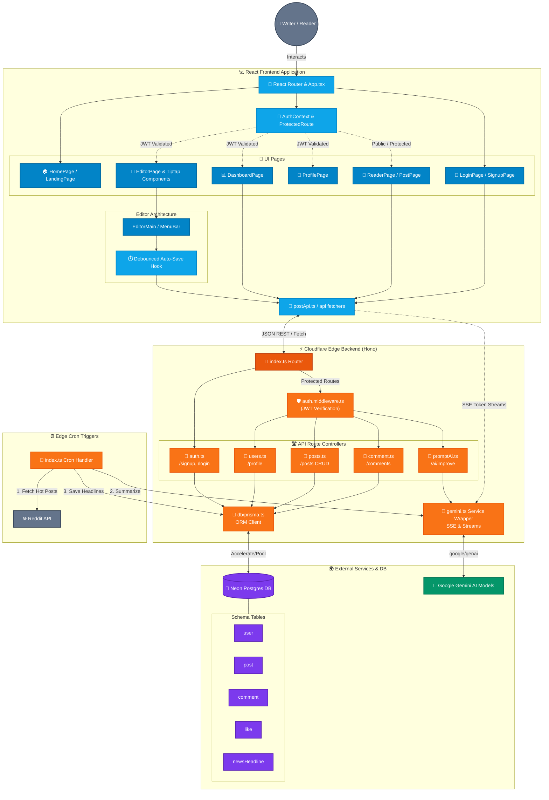

# LetterAlchemy ✍️

> An AI-native realtime writing and reading platform built on Cloudflare's edge stack — exploring how low-latency AI systems can feel expressive, contextual, and human rather than simply functional.

[](https://www.typescriptlang.org/)
[](https://hono.dev/)
[](https://react.dev/)
[](https://www.prisma.io/)

---

## 🌐 Live Demo

| Service  | URL                                                                              |
| -------- | -------------------------------------------------------------------------------- |
| Frontend | [letteralchemy.pages.dev](https://letteralchemy.pages.dev)                       |
| Backend  | [backend.arpit-verma-av.workers.dev](https://backend.arpit-verma-av.workers.dev) |

---

## 📖 What Is LetterAlchemy?

LetterAlchemy is a **full-stack blogging platform** where writers can draft, publish, and enhance their posts using AI-powered tools wired directly into the writing workflow.

It is not a toy. Every AI feature is deliberately instrumented — prompts are versioned in the database, every AI call is logged with response time and success/failure status, and a dashboard surfaces usage analytics in real time. This is the same discipline required to run AI agents in production.

---

## ✨ Key Features

### Core Platform

- ✅ **Auth** — JWT-based sign-up, login, protected routes
- ✅ **Rich-Text Editor** — Tiptap v3 with bold, italic, headings, lists, blockquotes
- ✅ **Auto-Save** — Debounced draft persistence (1s) — never lose work
- ✅ **Publish Flow** — Drafts → published posts with slug support
- ✅ **Public Feed** — View all published posts with author, like, and comment counts
- ✅ **Likes & Comments** — Engagement layer on every post
- ✅ **News Headlines** — Scheduled Cloudflare Worker fetches Reddit hot posts and AI-summarizes them via Gemini

### AI Features (in progress)

- 🔄 **AI Writing Assistant** — Select text → LLM rewrites/improves inline with streaming
- 🔄 **Tone Analyzer** — Classifies post tone: Empathetic / Aggressive / Neutral / Informative
- 🔄 **Auto-Summary Generator** — On publish: 3-line TL;DR prepended to every post
- 🔄 **Tweet Generator** — One click → punchy tweet from blog content
- 🔄 **Comment Sentiment Detection** — Classifies comments: Positive / Neutral / Negative
- 🔄 **Eval Dashboard** — AI usage logs, active prompt versions, per-user analytics
- 🔄 **Prompt Versioning** — Prompts stored in DB with version IDs; rollback without redeploy

---

## 🛠️ Tech Stack

| Layer      | Technology                                                        |
| ---------- | ----------------------------------------------------------------- |
| Frontend   | React 19, TypeScript, Vite, TailwindCSS v4, shadcn/ui, Tiptap v3 |
| Backend    | Hono, TypeScript, Cloudflare Workers (edge runtime)               |
| Realtime   | SSE Streaming, TransformStreams, Parallel AI Orchestration         |
| Database   | PostgreSQL (Neon serverless), Prisma ORM + Accelerate             |
| AI         | Google Gemini API (`@google/genai`)                               |
| Auth       | JWT (custom middleware), bcryptjs                                 |
| Validation | Zod (shared schemas across FE and BE)                             |
| Scheduling | Cloudflare Workers Cron Triggers                                  |
| Deployment | Frontend → Vercel · Backend → Cloudflare Workers                  |

---

## 🏗️ Architecture



---

## 🧪 Realtime AI Reader Pipeline (Experimental)

LetterAlchemy now includes an experimental realtime AI reader pipeline focused on low-latency inference orchestration and progressive response delivery.

Current backend architecture:

- Cloudflare Workers AI for ultra-fast contextual summarisation
- Gemini Flash for grounded long-form article Q&A
- Parallel Promise.all-based orchestration to reduce blocking inference chains
- Streaming token delivery using Server-Sent Events (SSE) and TransformStreams
- Recursive Tiptap JSON extraction pipelines converting rich-text editor structures into AI-readable contextual article text
- Latency-conscious separation between fast context generation and long-form grounded responses

### Current Status

- ✅ Backend orchestration implemented
- ✅ Parallel AI execution working
- ✅ Streaming backend infrastructure working
- 🔄 Frontend progressive token rendering currently in development
- 🔄 Voice interaction workflows planned

The goal is to explore AI UX patterns where responsiveness itself becomes part of the product experience.

---

## 🗄️ Database Schema

```prisma
model user          { id, email, firstName, lastName, password, bio, socialLinks }
model post          { id, title, content (JSON), slug, published, views, authorId }
model comment       { id, text, postId, authorId }
model like          { id, postId, authorId }  // @@unique([postId, authorId])
model newsHeadline  { id, text, url (unique), title, category }
model aiTweet       { id, tweet, postId }
// Coming:
// model ai_logs       { id, featureName, promptVersion, durationMs, success, postId }
// model prompt_configs { id, featureName, promptText, version, isActive }
```

---

## 📁 Project Structure

```
LetterAlchemy/
├── backend/
│   ├── src/
│   │   ├── index.ts           # Hono app entry + Cron handler
│   │   ├── routes/
│   │   │   ├── auth.ts        # /signup, /login
│   │   │   └── posts.ts       # CRUD, publish, AI routes (coming)
│   │   ├── middleware/
│   │   │   └── auth.middleware.ts
│   │   ├── services/
│   │   │   └── gemini.ts      # Gemini AI wrapper
│   │   ├── db/
│   │   │   └── prisma.ts      # Prisma client factory
│   │   ├── schemas/
│   │   │   └── auth.schema.ts # Zod schemas
│   │   └── types/
│   │       └── env.ts         # Cloudflare env bindings
│   ├── prisma/
│   │   └── schema.prisma
│   └── wrangler.jsonc
│
└── frontend/
    ├── src/
    │   ├── App.tsx             # Routes
    │   ├── pages/
    │   │   ├── EditorPage.tsx  # Editor with auto-save
    │   │   ├── HomePage.tsx    # Public feed
    │   │   ├── Dashboard.tsx   # User dashboard (AI analytics coming)
    │   │   ├── PostPage.tsx    # Blog reader
    │   │   ├── LoginPage.tsx
    │   │   └── SignupPage.tsx
    │   ├── components/
    │   │   ├── editor/
    │   │   │   ├── EditorMain.tsx
    │   │   │   ├── MenuBar.tsx
    │   │   │   ├── Title.tsx
    │   │   │   └── TopBarEditor.tsx
    │   │   └── ui/             # shadcn/ui components
    │   ├── api/
    │   │   └── postApi.ts      # API client functions
    │   ├── context/
    │   │   └── AuthContext.tsx
    │   └── hooks/
```

---

## 🚀 Getting Started

### Prerequisites

- Node.js 20+
- PostgreSQL database (or [Neon](https://neon.tech) free tier)
- [Cloudflare account](https://dash.cloudflare.com) (free)
- Google Gemini API key ([AI Studio](https://aistudio.google.com))

### 1. Clone

```bash
git clone https://github.com/ArpitNanu/LetterAlchemy.git
cd LetterAlchemy
```

### 2. Backend Setup

```bash
cd backend
npm install

# Copy env vars
cp .dev.vars.example .dev.vars
# Edit .dev.vars — add DATABASE_URL, JWT_SECRET, GEMINI_API_KEY

# Push schema to DB
npx prisma db push

# Run locally
npm run dev        # starts on http://localhost:8787
```

### 3. Frontend Setup

```bash
cd ../frontend
npm install

# Create .env
echo "VITE_API_URL=http://localhost:8787" > .env

# Run locally
npm run dev        # starts on http://localhost:5173
```

---

## 🔐 Environment Variables

### Backend (`.dev.vars`)

| Variable         | Description                      |
| ---------------- | -------------------------------- |
| `DATABASE_URL`   | Neon PostgreSQL connection string |
| `JWT_SECRET`     | Secret for signing JWT tokens    |
| `GEMINI_API_KEY` | Google Gemini API key            |

### Frontend (`.env`)

| Variable       | Description          |
| -------------- | -------------------- |
| `VITE_API_URL` | Backend API base URL |

---

## 🧠 AI Design Philosophy

Every AI feature in LetterAlchemy is built with the same discipline required to run AI agents in production:

1. **Prompts are versioned in the database** — not hardcoded. Every change is logged with date, author, and a performance snapshot. You can roll back without redeploying.
2. **Every AI call is logged** — feature name, prompt version, duration (ms), success/failure, and the postId it was called on. This is observable AI, not a black box.
3. **Streaming where latency matters** — the Writing Assistant streams tokens as they arrive instead of waiting for the full response. Latency is UX.
4. **Tone is a first-class signal** — the Tone Analyzer classifies content as Empathetic / Aggressive / Neutral / Informative and stores the result in the DB. This mirrors real-world problems in borrower communication, content moderation, and brand safety.

---

## 🔮 Planned Features (v2)

- **Blog Chat with RAG** — Each blog gets an AI chat interface. Questions answered from blog context; unanswered questions notify the author to fill the gap.
- **A/B Prompt Testing** — Run two prompt versions in parallel, compare quality scores, promote winner.
- **RBI-Aware Tone Guardrails** — A compliance layer that intercepts AI output and validates it against defined constraints before delivery (inspired by fintech agent design).
- **Voice-to-Post** — STT-powered dictation for writing blog posts hands-free.
- **Realtime Voice Conversations** — Speech-to-text driven conversational article interaction workflows
- **Persistent AI Reader Context** — Long-session memory for personalized contextual reading assistance

---

## 💡 What I Learned Building This

- How to run an AI service at the edge (Cloudflare Workers) with Gemini, handling V8 heap constraints
- How prompt versioning changes the relationship between deployment and model quality
- Why streaming responses are not a nice-to-have — they are a latency contract with the user
- How `Promise.allSettled` prevents one failed fetch from crashing parallel AI calls
- Why Tiptap's JSON content model is the right format for structured AI rewrites (you can surgically replace a node, not just append text)
- Why progressive streaming architectures fundamentally change perceived AI responsiveness and product feel
- How separating fast contextual inference from slower grounded responses improves realtime UX design

---

## 🧭 Engineering Direction

LetterAlchemy is increasingly evolving from a blogging platform into an experimentation space for AI-native product systems focused on:

- realtime interaction
- streaming UX
- latency-conscious AI orchestration
- edge-runtime infrastructure
- human-centered AI workflows

> _"The best writing tool is the one that gets out of your way — until you need it."_

---

## 🤝 Contributing

PRs welcome. Open an issue first for significant changes.

---

## 📄 License

MIT
