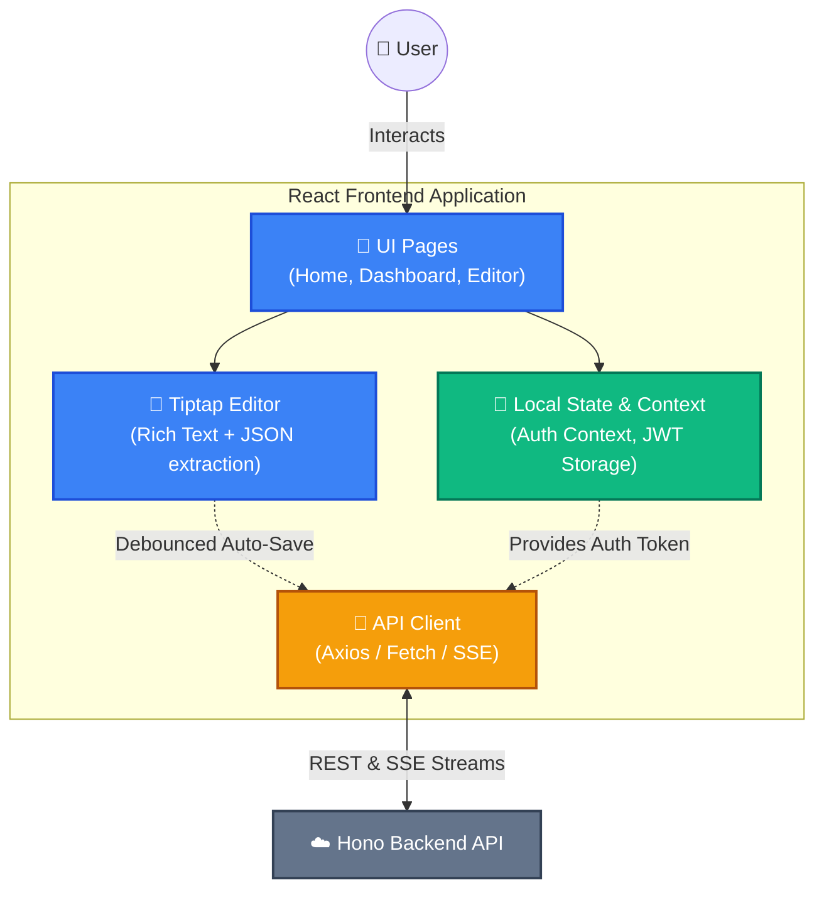

# LetterAlchemy Frontend 🎨

> The user interface and client-side application for LetterAlchemy, built for speed, rich interactions, and progressive AI token streaming. ⚡️

---

## 🛠️ Tech Stack

- **Framework:** React 19 + TypeScript ⚛️
- **Build Tool:** Vite ⚡️
- **Styling:** TailwindCSS v4 + shadcn/ui 🎨
- **Rich Text Editor:** Tiptap v3 📝
- **Deployment:** Cloudflare Pages (or Vercel) ☁️

---

## 🏗️ Architecture & Flow

The frontend is strictly responsible for the presentation layer, local state management, and real-time interaction rendering. It communicates with the Hono/Cloudflare backend via standard REST APIs and Server-Sent Events (SSE) for AI streaming.



### 🎯 Key Responsibilities:
- **Editor & Auto-Save 💾:** Uses Tiptap for rich-text editing with a debounced 1-second auto-save to ensure work is never lost.
- **AI Streaming UI (WIP) 🌊:** Capable of progressively rendering tokens streamed from the backend during AI rewrite or context operations.
- **Authentication 🔐:** Manages JWT tokens securely on the client side (context/storage) to protect routes like the dashboard and editor.

---

## 🚀 Getting Started Locally

### 1️⃣ Install Dependencies
```bash
npm install
```

### 2️⃣ Environment Variables
Create a `.env` file in the root of the `frontend` folder.
```env
VITE_API_URL=http://localhost:8787
```

### 3️⃣ Run Development Server
```bash
npm run dev
```
The application will be available at `http://localhost:5173` 🌐.

---

## 📁 Folder Structure

```text
frontend/
├── src/
│   ├── App.tsx             # 🚦 Main routing and layout
│   ├── pages/              # 📄 Page-level components (Editor, Home, Dashboard, etc.)
│   ├── components/
│   │   ├── editor/         # 📝 Tiptap specific components (Menu, Toolbar, Main)
│   │   └── ui/             # 🧩 Reusable shadcn/ui elements
│   ├── api/
│   │   └── postApi.ts      # 🔌 Data fetching and mutation functions
│   ├── context/
│   │   └── AuthContext.tsx # 🔐 Global authentication state
│   └── hooks/              # 🎣 Custom React hooks
```
